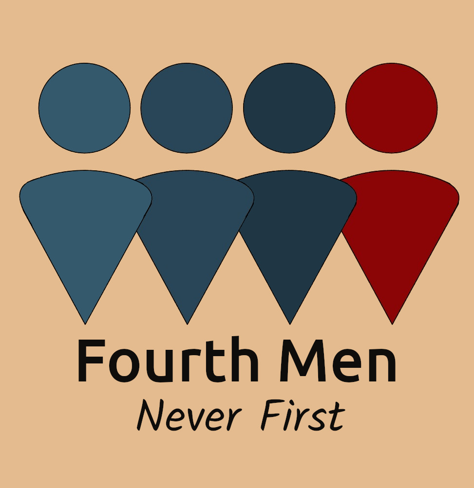

# Steve is Tired
A game made by *these fine men*[1](https://github.com/SFR-git)[2](https://github.com/3174N)[3](https://github.com/g33king)[4](https://github.com/TEmadethemistakeofbeingongithub) for the [Brackeys Game Jam 2020.2](https://itch.io/jam/brackeys-4).

## About the game
In *Steve is Tired*, you help Steve from accounting escape the office and his boss, who demands Steve work another shift.
Along the way, you find a can of *W◂◂RP Energy Drink*, which lets Steve go back to a recent point in time.
Move boxes, flip switches, and rewind your way to the exit!

This game consists of **$NUMBER** levels, and saves in the loading zone between them. 

## Play the game
This game was made with WebGL in mind, in order to submit it on itch.io. You can play it [here](https://sfr.moe/play).
With that in mind, if you want to install the game locally, you will find releases on the [releases page](https://github.com/SFR-git/4thmen-bj4/releases).

## Credits
### Creators

Hello. We're the Fourth Men. 
* [3174N](https://github.com/3174N): progamming, ideas, website and soundtrack
* [SFR](https://github.com/SFR-git): ideas, level design, playtesting, website, SFXs and GitHub repo management
* [g33king](https://github.com/g33king): art, level design, ideas and programming
* [TE](https://github.com/TEmadethemistakeofbeingongithub): art and bothering to use GitHub

### Assets
* *Munro* font pack by [Ten by Twenty](https://www.tenbytwenty.com)
  * SIL Open Font licensed, pay-what-you-want font pack for commercial and non-commercial use!
* color palette based on the *CC-29* Colour palette by Alpha6 on [Lospec](https://lospec.com/palette-list/cc-29)

### Ideas
9gag for inspiring maymays

### Special thanks
9gag for funny maymays

## License & Contributing
This game is licensed under MIT, which means: **go nuts**.

Feel free to fork, mod, copy and change all of our stuff (not licensed from a third party), as long as you give us credit and acknowedge the license.
**PRs are welcome, too :D**
